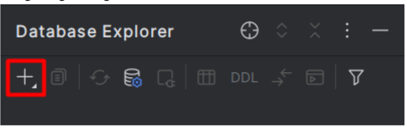

## bugungu mavzu: aggregate functions sum, count, max, min, length, avg
### table create qlish
```postgresql
create table product(
    product_id serial,
    product_name text,
    product_color text,
    product_type text,
    product_price double precision
);
```


[fsdfsdf](https://www.mockaroo.com/)


### sum bu function hisbolanib, int yoki float tipidage qiymatlarni yig`ib berish uchun foydalaniladi

```postgresql
select sum(product_price)
from product;
```

### count function bu bitta table ni ichidan nechta bir xillari borligini sanab beruvchi function hisoblanandi

```postgresql
select count(*)
from product where product_color = 'Red';
```

### max va min functionlari bu maximum va minimumni hisoblaydi

```postgresql
select max(product_price)
from product;

select min(product_price)
from product;
```

### length functioni bu uzunligini hisoblaydi. ko`p vaziyatlarda permission yozishda ishlatiladi

```postgresql
select length(product_name)
from product;
```

### avg function bu o`rtacha qiymatni qaytarib beradi

```postgresql
select avg(product_price)
from product;


select avg(product_price)
from product
where product_color = 'Red';
```